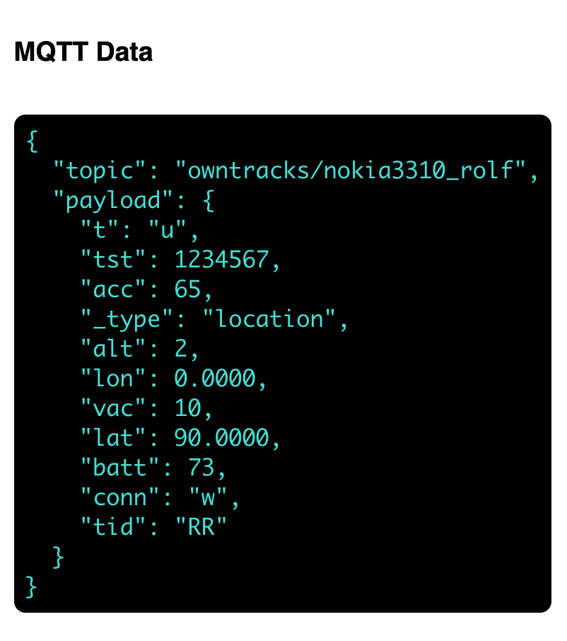

# MQTT Broker Connection Test
- [Express](https://expressjs.com/de/) server with [socket](https://socket.io/) connection to the frontend
- connetcs to any MQTT broker using any protocol via credentials configured in environment variables
- outputs formatted MQTT `topic` and `payload` to browser window


## Install & run locally
- create a `.env` file in the project's root directory:
```
USERNAME=username
PASSWORD=password
# protocol://hostname [wss|mqtts|mqtt]
HOSTNAME_MQTT_BROKER=mqtts://your.broker.com
PORT_MQTT_BROKER=1183
```
- install dependencies & run
```
# install dependencies
npm install

# run on localhost:3000 (default)
npm start
```

Any connection errors (e.g. 'not authenticated') are visible in stdout. Request data is logged there as well in a non-production environment.
